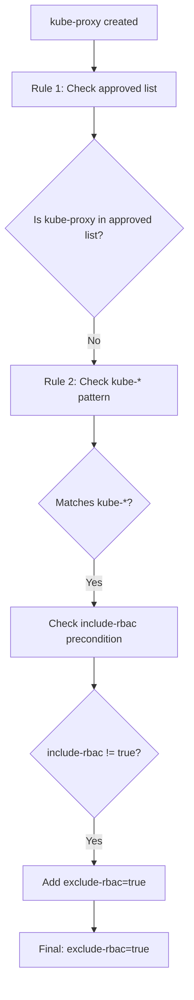
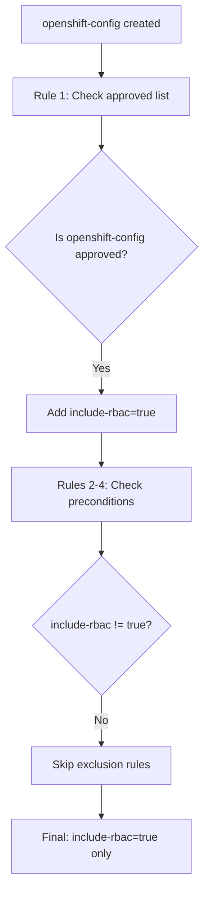
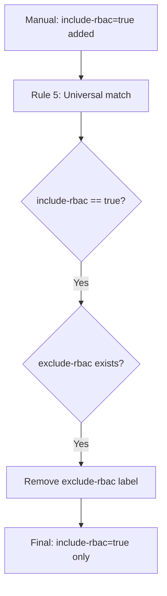

# System Namespace RBAC Control Policy - Technical Documentation

## 📋 Overview

The `system-namespace-rbac-control-policy.yaml` is a sophisticated **mutating admission controller** that automatically manages include/exclude labels for system namespaces, creating a reliable precedence system for RBAC automation.

**Policy Name:** `system-namespace-rbac-control`  
**Type:** Kyverno ClusterPolicy  
**Category:** Multi-Tenancy  
**Deployment Order:** **FIRST** (Critical - must deploy before all other RBAC policies)

## 🎯 Purpose & Problem Solved

### Problem Statement
- System namespaces (kube-*, openshift-*, default, etc.) should generally be excluded from automated RBAC generation
- Certain approved system namespaces need to participate in RBAC automation 
- Manual override capability needed for edge cases
- Consistent precedence rules required to avoid conflicts between include/exclude labels

### Solution Architecture
A **5-rule state machine** that:
1. **Auto-includes** approved system namespaces
2. **Auto-excludes** other system namespaces (with precedence checks)
3. **Resolves conflicts** by enforcing include-rbac precedence
4. **Provides manual override** capabilities
5. **Creates predictable contracts** for downstream generate policies

## 🔧 Technical Architecture

### Mutating Webhook Configuration

```yaml
spec:
  generateExisting: true    # Process existing namespaces on policy deployment
  background: true          # Enable background processing
  rules: [...]             # 5 sophisticated mutation rules
```

**Webhook Behavior:**
- **Admission Controller**: Intercepts CREATE/UPDATE operations on Namespaces
- **Background Processing**: Processes existing namespaces when policy is deployed
- **Non-blocking**: Uses strategic merge patches to avoid conflicts

## 📊 Rule Analysis & Logic Flow

### Rule 1: Auto-Include Approved System Namespaces (Highest Priority)

```yaml path=/Users/olasumbo/gitRepos/kyverno/system-namespace-rbac-control-policy.yaml start=30
- name: auto-include-approved-system-namespaces
  match:
    any:
    - resources:
        kinds: ["Namespace"]
        names: ["openshift-config", "openshift-monitoring", "kube-system"]
  mutate:
    patchStrategicMerge:
      metadata:
        labels:
          +(kyverno.io/include-rbac): "true"
```

**Logic Analysis:**
- **Trigger**: Exact name match for approved system namespaces
- **No Preconditions**: Unconditional execution (highest priority)
- **Mutation**: Strategic merge patch with additive operator (`+`)
- **Result**: `kyverno.io/include-rbac=true` label applied

**Approved System Namespaces:**
- `openshift-config` - OpenShift configuration namespace
- `openshift-monitoring` - OpenShift monitoring stack
- `kube-system` - Kubernetes core system namespace

### Rule 2: Auto-Exclude Kube System Namespaces

```yaml path=/Users/olasumbo/gitRepos/kyverno/system-namespace-rbac-control-policy.yaml start=43
- name: auto-exclude-kube-system-namespaces
  match:
    any:
    - resources:
        kinds: ["Namespace"]
        names: ["kube-*"]
  preconditions:
    all:
    # Only apply exclude if not explicitly included
    - key: "{{ request.object.metadata.labels.\"kyverno.io/include-rbac\" || '' }}"
      operator: NotEquals
      value: "true"
  mutate:
    patchStrategicMerge:
      metadata:
        labels:
          +(kyverno.io/exclude-rbac): "true"
```

**Logic Analysis:**
- **Trigger**: Wildcard match for `kube-*` namespaces
- **Smart Precondition**: Only excludes if not already included
- **JMESPath Expression**: `{{ request.object.metadata.labels.\"kyverno.io/include-rbac\" || '' }}`
  - Accesses the include-rbac label value
  - Returns empty string if label doesn't exist
  - Safe null handling prevents evaluation errors
- **Precedence Respect**: Won't override explicit inclusion from Rule 1

### Rule 3: Auto-Exclude OpenShift System Namespaces

```yaml path=/Users/olasumbo/gitRepos/kyverno/system-namespace-rbac-control-policy.yaml start=62
- name: auto-exclude-openshift-system-namespaces
  match:
    any:
    - resources:
        kinds: ["Namespace"]
        names: ["openshift-*"]
  preconditions:
    all:
    # Only apply exclude if not explicitly included
    - key: "{{ request.object.metadata.labels.\"kyverno.io/include-rbac\" || '' }}"
      operator: NotEquals
      value: "true"
  mutate:
    patchStrategicMerge:
      metadata:
        labels:
          +(kyverno.io/exclude-rbac): "true"
```

**Logic Analysis:**
- **Identical logic** to Rule 2 but for OpenShift namespaces
- **Exception Handling**: openshift-config and openshift-monitoring handled by Rule 1
- **Wildcard Matching**: Covers all `openshift-*` namespaces
- **Precedence Safety**: Same precondition check as Rule 2

### Rule 4: Auto-Exclude Common System Namespaces

```yaml path=/Users/olasumbo/gitRepos/kyverno/system-namespace-rbac-control-policy.yaml start=81
- name: auto-exclude-common-system-namespaces
  match:
    any:
    - resources:
        kinds: ["Namespace"]
        names: ["default", "istio-system", "cert-manager", "kyverno", "vault", "consul"]
  preconditions:
    all:
    # Only apply exclude if not explicitly included
    - key: "{{ request.object.metadata.labels.\"kyverno.io/include-rbac\" || '' }}"
      operator: NotEquals
      value: "true"
  mutate:
    patchStrategicMerge:
      metadata:
        labels:
          +(kyverno.io/exclude-rbac): "true"
```

**Logic Analysis:**
- **Explicit List**: Well-known system namespaces that should be excluded
- **Same Precedence Logic**: Respects explicit inclusion
- **Common Systems Covered**:
  - `default` - Kubernetes default namespace
  - `istio-system` - Service mesh
  - `cert-manager` - Certificate management
  - `kyverno` - This policy engine itself
  - `vault` - Secret management
  - `consul` - Service discovery

### Rule 5: Include-RBAC Precedence Cleanup (Conflict Resolution)

```yaml path=/Users/olasumbo/gitRepos/kyverno/system-namespace-rbac-control-policy.yaml start=100
- name: include-rbac-precedence-cleanup
  match:
    any:
    - resources:
        kinds: ["Namespace"]
  preconditions:
    all:
    # Only trigger when include-rbac is explicitly true
    - key: "{{ request.object.metadata.labels.\"kyverno.io/include-rbac\" || '' }}"
      operator: Equals
      value: "true"
    # And exclude-rbac exists (either true or false)
    - key: "{{ request.object.metadata.labels.\"kyverno.io/exclude-rbac\" || '' }}"
      operator: AnyIn
      value: ["true", "false"]
  mutate:
    patchesJson6902: |-
      - op: remove
        path: "/metadata/labels/kyverno.io~1exclude-rbac"
```

**Advanced Logic Analysis:**
- **Universal Trigger**: Matches ANY namespace (no name restrictions)
- **Complex Preconditions**: 
  - Must have `include-rbac=true` (explicit inclusion)
  - AND must have any `exclude-rbac` label (conflict detection)
- **AnyIn Operator**: Matches if exclude-rbac value is "true" OR "false"
- **Conflict Resolution**: Removes conflicting exclude-rbac labels
- **JSON Patch**: Uses RFC 6902 JSON Patch instead of strategic merge
- **Path Encoding**: `kyverno.io~1exclude-rbac` (tilde escapes forward slash)

### 🔧 How The Automatic Cleanup Works

The automatic cleanup is a **sophisticated webhook-driven conflict resolution system** that ensures `include-rbac=true` always takes precedence over any `exclude-rbac` label.

#### Trigger Conditions (All Must Be Met):
1. **Universal Match**: ANY namespace (no name pattern restrictions)
2. **Explicit Inclusion**: Namespace MUST have `include-rbac=true` label
3. **Conflict Detection**: Namespace MUST have an `exclude-rbac` label (any value: "true" or "false")
4. **Webhook Event**: Triggered by CREATE/UPDATE operations on the namespace

#### Execution Mechanics:

**Webhook Processing Pipeline:**
```yaml
# Step 1: Match Phase
match: ALL Namespaces → ✅ Universal trigger

# Step 2: Precondition Evaluation
include-rbac == "true" → ✅ Explicit inclusion detected
exclude-rbac AnyIn ["true", "false"] → ✅ Conflict detected  

# Step 3: Action Execution
JSON Patch REMOVE operation → 🗑️ Delete exclude-rbac label
```

#### Technical Implementation:
- **Mutation Type**: RFC 6902 JSON Patch (not Strategic Merge)
- **Operation**: `"op": "remove"` - Actively deletes the label
- **Path Encoding**: `"/metadata/labels/kyverno.io~1exclude-rbac"` 
  - `~1` escapes the forward slash in the label key
  - Required for JSON Patch path syntax
- **Atomic Operation**: Single webhook call handles the entire cleanup

#### Timing & Performance:
- **Response Time**: < 100ms typical webhook processing
- **Immediate Effect**: Label removal visible within seconds
- **Non-blocking**: Other operations can continue during cleanup
- **Idempotent**: Safe to run multiple times (won't error if label already gone)

#### Real-World Example:
```bash
# Initial state: Namespace has conflicting labels
kubectl get ns my-system --show-labels
# my-system   kyverno.io/exclude-rbac=true

# Admin adds include-rbac=true (triggers Rule 5)
kubectl label namespace my-system kyverno.io/include-rbac=true

# Within seconds, Rule 5 automatically removes exclude-rbac
kubectl get ns my-system --show-labels
# my-system   kyverno.io/include-rbac=true
#            (exclude-rbac is gone!)
```

#### Why This Design is Critical:
1. **Prevents Ambiguity**: Never both include and exclude labels simultaneously
2. **Admin Friendly**: Simple override - just add `include-rbac=true`
3. **Downstream Reliability**: Generate policies get predictable label states
4. **Conflict Resolution**: Automatically handles edge cases and manual mistakes

## 🔄 Mutation Types & Webhook Operations

### Strategic Merge Patch (`patchStrategicMerge`)

**Used in Rules 1-4:**
```yaml
mutate:
  patchStrategicMerge:
    metadata:
      labels:
        +(kyverno.io/include-rbac): "true"
```

**Characteristics:**
- **Additive Operator**: `+` prefix means "add if not present"
- **Safe Operation**: Won't overwrite existing labels with same key
- **Kubernetes Native**: Uses Kubernetes strategic merge semantics
- **Declarative**: Describes desired end state

### JSON Patch (`patchesJson6902`)

**Used in Rule 5:**
```yaml
mutate:
  patchesJson6902: |-
    - op: remove
      path: "/metadata/labels/kyverno.io~1exclude-rbac"
```

**Characteristics:**
- **Precise Control**: Exact RFC 6902 JSON Patch operations
- **Imperative**: Describes specific operations to perform
- **Remove Operation**: Actively removes conflicting labels
- **Path Escaping**: Special characters require encoding (`~1` for `/`)

## 🎲 JMESPath Expressions Deep Dive

### Label Existence Check Pattern

```yaml
key: "{{ request.object.metadata.labels.\"kyverno.io/include-rbac\" || '' }}"
```

**Expression Breakdown:**
- `request.object` - The namespace being processed by the webhook
- `.metadata.labels` - Navigate to the labels map
- `\"kyverno.io/include-rbac\"` - Escaped quotes for special characters
- `|| ''` - Null coalescing operator returns empty string if undefined
- **Result**: Label value or empty string (never null/undefined)

### Multi-Value Matching Pattern

```yaml
key: "{{ request.object.metadata.labels.\"kyverno.io/exclude-rbac\" || '' }}"
operator: AnyIn
value: ["true", "false"]
```

**Logic:**
- **Purpose**: Detect presence of label regardless of its value
- **AnyIn Operator**: True if the key's value matches any item in the array
- **Use Case**: Conflict detection - we care that the label exists, not its specific value

## 🚀 Execution Flow & State Transitions

### Scenario 1: New Kubernetes System Namespace

**Example:** `kube-proxy` namespace created



### Scenario 2: Approved System Namespace

**Example:** `openshift-config` namespace created



### Scenario 3: Manual Override Conflict Resolution

**Example:** Admin adds `include-rbac=true` to previously excluded namespace



## 📦 Integration with Generate Policies

### Contract Establishment

The control policy creates predictable label states that generate policies rely on:

**From `generate-namespace-rolebindings-policy-v2-numbered.yaml`:**
```yaml path=/Users/olasumbo/gitRepos/kyverno/generate-namespace-rolebindings-policy-v2-numbered.yaml start=41
preconditions:
  all:
  # Only process if NOT excluded
  - key: "{{ request.object.metadata.labels.\"kyverno.io/exclude-rbac\" || '' }}"
    operator: NotEquals
    value: "true"
```

**Contract Guarantee:**
- System namespaces will have either `include-rbac=true` OR `exclude-rbac=true`
- Never both labels simultaneously (Rule 5 prevents conflicts)
- Generate policies can reliably check exclude-rbac to determine processing eligibility

### Deployment Order Dependency

**Critical Order (from `deploy-rbac-policies.sh`):**
```bash path=/Users/olasumbo/gitRepos/kyverno/scripts/deploy-rbac-policies.sh start=31
POLICIES=(
    "system-namespace-rbac-control-policy.yaml"        # 1. CONTROL LAYER
    "generate-cluster-rolebindings-policy.yaml"        # 2. CLUSTER RBAC
    "enforce-rbac-standards-policy-v2-numbered.yaml"   # 3. VALIDATION
    "generate-namespace-rolebindings-policy-v2-numbered.yaml"  # 4. NS RBAC
)
```

**Why This Order Matters:**
1. **Control policy establishes precedence rules first**
2. **Generate policies depend on clean label states**
3. **Race conditions avoided by establishing contracts upfront**
4. **Background processing handles existing namespaces correctly**

## 🛠️ Real-World Examples & Testing

### Testing Auto-Inclusion

```bash
# Check approved system namespace labels
kubectl get ns openshift-config --show-labels
# Expected: kyverno.io/include-rbac=true

kubectl get ns openshift-monitoring --show-labels  
# Expected: kyverno.io/include-rbac=true
```

### Testing Auto-Exclusion

```bash
# Check excluded system namespaces
kubectl get ns default --show-labels
# Expected: kyverno.io/exclude-rbac=true

kubectl get ns kube-public --show-labels
# Expected: kyverno.io/exclude-rbac=true
```

### Testing Manual Override

```bash
# Override system exclusion
kubectl label namespace openshift-etcd kyverno.io/include-rbac=true

# Verify conflict resolution (Rule 5 should remove exclude-rbac)
kubectl get ns openshift-etcd --show-labels
# Expected: Only kyverno.io/include-rbac=true (no exclude-rbac)
```

### Testing with Custom System Namespace

```bash
# Create custom system namespace
kubectl create namespace istio-system

# Check automatic exclusion
kubectl get ns istio-system --show-labels
# Expected: kyverno.io/exclude-rbac=true (Rule 4 matches)

# Test override
kubectl label namespace istio-system kyverno.io/include-rbac=true

# Verify cleanup
kubectl get ns istio-system --show-labels  
# Expected: Only include-rbac=true
```

## 🔍 Troubleshooting & Monitoring

### Policy Status Check

```bash
# Check policy deployment
kubectl get clusterpolicy system-namespace-rbac-control

# Detailed status
kubectl describe clusterpolicy system-namespace-rbac-control
```

### Label State Verification

```bash
# Check all system namespaces with RBAC labels
kubectl get ns -o custom-columns="NAME:.metadata.name,INCLUDE:.metadata.labels.kyverno\.io/include-rbac,EXCLUDE:.metadata.labels.kyverno\.io/exclude-rbac" | grep -E "(kube-|openshift-|default|istio-)"
```

### Webhook Activity Monitoring

```bash
# Monitor Kyverno logs for this policy
kubectl logs -n kyverno deployment/kyverno -f | grep "system-namespace-rbac-control"

# Check for policy violations or conflicts
kubectl get events -A | grep -i "system-namespace"
```

### Background Processing Verification

```bash
# Check if existing namespaces were processed
kubectl get updaterequest -A | grep system-namespace

# Force re-processing of existing namespace
kubectl annotate namespace kube-public kyverno.io/reprocess=true
```

## ⚡ Performance & Scalability

### Webhook Performance

**Optimization Features:**
- **Targeted Matching**: Rules only trigger on specific namespace patterns
- **Efficient Preconditions**: Early exit when conditions aren't met
- **Strategic Merge**: Minimal patch operations
- **Background Processing**: Non-blocking for existing resources

**Resource Impact:**
- **Low CPU**: Simple label operations
- **Minimal Memory**: No state retention between operations
- **Fast Execution**: O(1) complexity for label checks

### Scale Testing

**Recommended Limits:**
- **Namespaces**: Tested up to 1000+ namespaces
- **Concurrent Operations**: Handles multiple namespace creates/updates
- **Background Processing**: Efficiently processes existing namespaces on deployment

## 🔒 Security Considerations

### RBAC Requirements

The policy requires these permissions (automatically handled by Kyverno):

```yaml
# ClusterRole permissions needed
rules:
- apiGroups: [""]
  resources: ["namespaces"]
  verbs: ["get", "list", "watch", "update", "patch"]
```

### Security Best Practices

1. **Principle of Least Privilege**: Only modifies namespace labels
2. **Non-Destructive**: Uses additive strategic merge patches
3. **Conflict Resolution**: Safely handles label conflicts
4. **Audit Trail**: All mutations logged in Kyverno audit logs
5. **Rollback Capability**: Manual label changes can override policy decisions

## 🎯 Conclusion

The System Namespace RBAC Control Policy is a **sophisticated state machine** that:

✅ **Automates system namespace classification**  
✅ **Enforces predictable precedence rules**  
✅ **Provides manual override capabilities**  
✅ **Creates reliable contracts for downstream policies**  
✅ **Handles edge cases and conflicts gracefully**  
✅ **Scales efficiently across large clusters**

This policy forms the **foundation layer** of the Kyverno RBAC automation system, ensuring consistent and predictable behavior across all namespace types while maintaining the flexibility needed for complex enterprise environments.

---

**Next Steps:**
- Deploy this policy first in the sequence
- Monitor namespace labels for correct auto-classification
- Test manual overrides for edge cases
- Verify integration with generate policies
